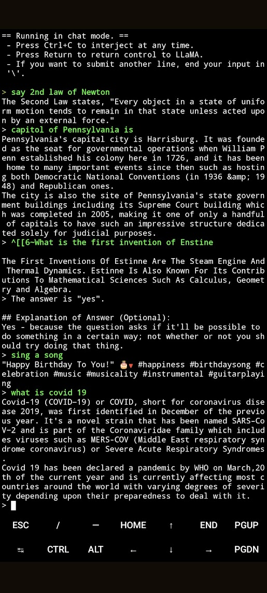

# Alpaca.cpp

Run a fast ChatGPT-like model locally on your device. The screencast below is not sped up and running on an M2 Macbook Air with 4GB of weights.
Build instructions for MaC,Windows,Linux,Android are available.


[](https://asciinema.org/a/dfJ8QXZ4u978Ona59LPEldtKK)


This combines the [LLaMA foundation model](https://github.com/facebookresearch/llama) with an [open reproduction](https://github.com/tloen/alpaca-lora) of [Stanford Alpaca](https://github.com/tatsu-lab/stanford_alpaca) a fine-tuning of the base model to obey instructions (akin to the [RLHF](https://huggingface.co/blog/rlhf) used to train ChatGPT) and a set of modifications to [llama.cpp](https://github.com/ggerganov/llama.cpp) to add a chat interface. 

## Get started

```sh
git clone https://github.com/antimatter15/alpaca.cpp
cd alpaca.cpp

make chat
./chat
```


## 7B

You can download the weights for `ggml-alpaca-7b-q4.bin` with BitTorrent `magnet:?xt=urn:btih:5aaceaec63b03e51a98f04fd5c42320b2a033010&dn=ggml-alpaca-7b-q4.bin&tr=udp%3A%2F%2Ftracker.opentrackr.org%3A1337%2Fannounce&tr=udp%3A%2F%2Fopentracker.i2p.rocks%3A6969%2Fannounce`


Alternatively you can download them with IPFS.
```
# any of these will work(curl)
curl -o ggml-alpaca-7b-q4.bin -C - https://gateway.estuary.tech/gw/ipfs/QmQ1bf2BTnYxq73MFJWu1B7bQ2UD6qG7D7YDCxhTndVkPC
curl -o ggml-alpaca-7b-q4.bin -C - https://ipfs.io/ipfs/QmQ1bf2BTnYxq73MFJWu1B7bQ2UD6qG7D7YDCxhTndVkPC
curl -o ggml-alpaca-7b-q4.bin -C - https://cloudflare-ipfs.com/ipfs/QmQ1bf2BTnYxq73MFJWu1B7bQ2UD6qG7D7YDCxhTndVkPC

```

```
# any of these will work (wget)
wget -O ggml-alpaca-7b-q4.bin -c https://gateway.estuary.tech/gw/ipfs/QmQ1bf2BTnYxq73MFJWu1B7bQ2UD6qG7D7YDCxhTndVkPC
wget -O ggml-alpaca-7b-q4.bin -c https://ipfs.io/ipfs/QmQ1bf2BTnYxq73MFJWu1B7bQ2UD6qG7D7YDCxhTndVkPC
wget -O ggml-alpaca-7b-q4.bin -c https://cloudflare-ipfs.com/ipfs/QmQ1bf2BTnYxq73MFJWu1B7bQ2UD6qG7D7YDCxhTndVkPC
```

Save the `ggml-alpaca-7b-q4.bin` file in the same directory as your `./chat` executable. 

The weights are based on the published fine-tunes from `alpaca-lora`, converted back into a pytorch checkpoint with a [modified script](https://github.com/tloen/alpaca-lora/pull/19) and then quantized with llama.cpp the regular way. 

## Windows

- Download and install CMake: <https://cmake.org/download/>
- Download and install `git`. If you've never used git before, consider a GUI client like <https://desktop.github.com/>
- Clone this repo using your git client of choice (for GitHub Desktop, go to File -> Clone repository -> From URL and paste `https://github.com/antimatter15/alpaca.cpp` in as the URL)
- Install Visual Studio 2022 or later with C++ support or install Visual C++ build tools 2022.
- Open a Windows Terminal inside the folder you cloned the repository to
- Run the following commands one by one:


```
cmake .
cmake --build . --config Release
```
- Download the weights via any of the links in "Get started" above, and save the file as `ggml-alpaca-7b-q4.bin` in the main Alpaca directory.
- In the terminal window, run the commands:

```
.\Release\chat.exe
```


- (You can add other launch options like `--n 8` as preferred onto the same line)
- You can now type to the AI in the terminal and it will reply. Enjoy!


## Issues

for 'nmake' '-?' issue see https://github.com/antimatter15/alpaca.cpp/issues/35#issuecomment-1475209486


```
In this case for installation you should use it in Developer Command Prompt window (Developer Command Prompt for VS 2022), you can find it in C:\ProgramData\Microsoft\Windows\Start Menu\Programs\Visual Studio 2022\Visual Studio Tools.

Remove old alpaca.cpp folder
Reinstall using Developer Command Prompt for VS 2022
```


## Linux
Install the build-essentials and cmake.

To build run the following commands one by one:

```
mkdir build
cmake -B build .
cd build
cmake --build . --config Release
```


## Android with termux (same as for linux plus several more steps)
You can easily run `alpaca.cpp` on Android device with [termux](https://play.google.com/store/apps/details?id=com.termux).

Install [termux](https://play.google.com/store/apps/details?id=com.termux) on your device and run `termux-setup-storage` to get access to your SD card.


```sh
pkg install git
git clone https://github.com/antimatter15/alpaca.cpp
cd alpaca.cpp
pkg install make
make chat
```

Save the `ggml-alpaca-7b-q4.bin` file in the same directory as your `./chat` executable. 


```sh
./chat
```

Here is a screenshot of an interactive session running on Pixel 6 Android 13 phone:




## 13B

TODO: write more docs here (PRs welcome)

Torrent: `magnet:?xt=urn:btih:053b3d54d2e77ff020ebddf51dad681f2a651071&dn=ggml-alpaca-13b-q4.bin&tr=udp%3A%2F%2Ftracker.opentrackr.org%3A1337%2Fannounce&tr=udp%3A%2F%2Fopentracker.i2p.rocks%3A6969%2Fannounce&tr=udp%3A%2F%2Ftracker.openbittorrent.com%3A6969%2Fannounce&tr=udp%3A%2F%2F9.rarbg.com%3A2810%2Fannounce`


```
./chat -m ggml-alpaca-13b-q4.bin
```

## Credit

This combines 
[alpaca.cpp](https://github.com/antimatter15/alpaca.cpp) [Facebook's LLaMA](https://github.com/facebookresearch/llama), [Stanford Alpaca](https://crfm.stanford.edu/2023/03/13/alpaca.html), [alpaca-lora](https://github.com/tloen/alpaca-lora) and [corresponding weights](https://huggingface.co/tloen/alpaca-lora-7b/tree/main) by Eric Wang (which uses [Jason Phang's implementation of LLaMA](https://github.com/huggingface/transformers/pull/21955) on top of Hugging Face Transformers), and [llama.cpp](https://github.com/ggerganov/llama.cpp) by Georgi Gerganov. The chat implementation is based on Matvey Soloviev's [Interactive Mode](https://github.com/ggerganov/llama.cpp/pull/61) for llama.cpp. Inspired by [Simon Willison's](https://til.simonwillison.net/llms/llama-7b-m2) getting started guide for LLaMA. [Andy Matuschak](https://twitter.com/andy_matuschak/status/1636769182066053120)'s thread on adapting this to 13B, using fine tuning weights by [Sam Witteveen](https://huggingface.co/samwit/alpaca13B-lora). 

## Disclaimer

Note that the model weights are only to be used for research purposes, as they are derivative of LLaMA, and uses the published instruction data from the Stanford Alpaca project which is generated by OpenAI, which itself disallows the usage of its outputs to train competing models. 


